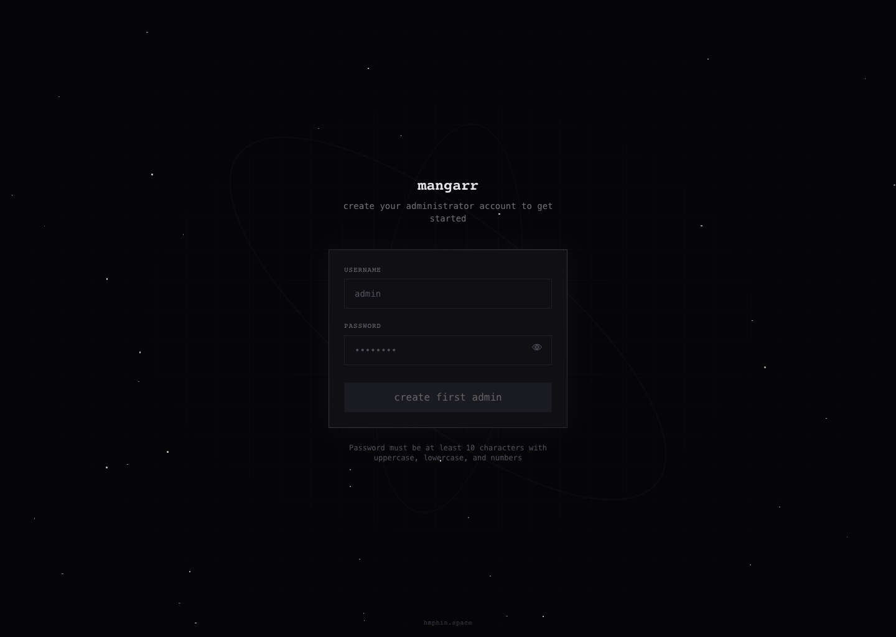
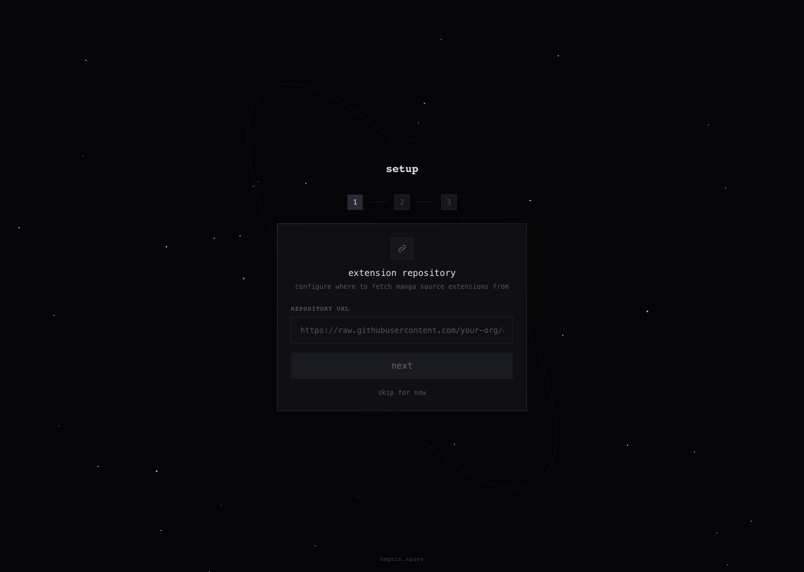

# Mangarr

Mangarr is a self-hosted manga manager built around a SvelteKit web app, a self-hosted Convex backend, and a Kotlin bridge that handles source access, downloads, and reader-side file serving.

## What It Does

- browse and search Tachiyomi-compatible sources
- import titles into a local library with statuses, collections, and progress
- download chapters and read them in the browser
- manage extensions, source preferences, proxy settings, and integration keys

## Screenshots





## Quick Start

Development:

```bash
docker compose -f compose.dev.yaml up --build
```

Production example:

```bash
docker compose up -d
```

Images:

- `ghcr.io/tftiwnbe/mangarr:edge`
- `ghcr.io/tftiwnbe/mangarr:latest`

## Docs

- [Deploy](docs/deploy.md)
- [Development](docs/development.md)
- [Integration API](docs/integration-api.md)

## Project Layout

- `web/` SvelteKit app plus Convex functions
- `bridge/` Kotlin/JVM bridge runtime
- `config/` persisted runtime state, extensions, auth material, and logs
- `data/` downloaded chapter files

## Credits

Mangarr builds on ideas and implementation work from the Tachiyomi ecosystem.

- The server-side foundation and extension-oriented workflow were heavily influenced by the earlier TachiWeb and Tachidesk line of projects.
- Large parts of the bridge-side extension runtime and self-hosted source workflow were adapted from or directly inspired by [Suwayomi-Server](https://github.com/Suwayomi/Suwayomi-Server).
- The `AndroidCompat` module was originally developed by [@null-dev](https://github.com/null-dev) and remains an important part of making extension code run on the JVM side.
- [Keiyoushi Extensions](https://github.com/keiyoushi/extensions) provides the extension catalog Mangarr uses through its bridge runtime.
- The broader extension author community made the source ecosystem this project depends on possible in the first place.

Please keep the original upstream licenses and attribution in mind when reusing or redistributing derivative work.

## License

Mangarr is licensed under the GNU Affero General Public License v3.0. See [LICENSE](LICENSE).
